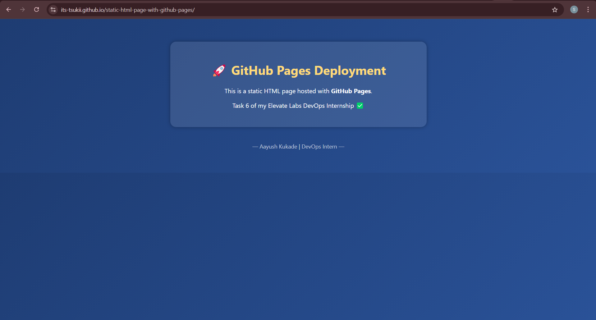
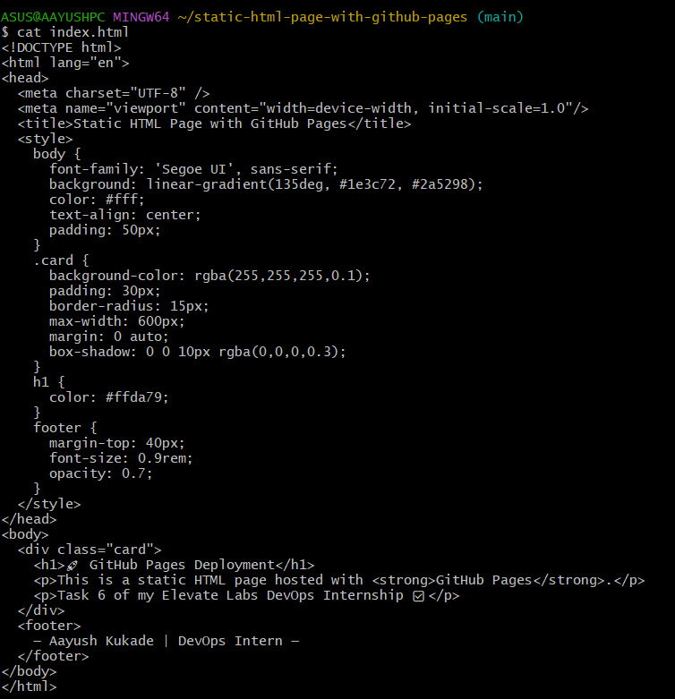

# Task 6 – Host a Static HTML Page with GitHub Pages 🚀

## 📌 Objective
As part of my DevOps Internship at **Elevate Labs**, the goal of this task was to deploy a simple **static HTML website** using **GitHub Pages**.

---

## 🛠 Tools & Technologies Used
- HTML5 & CSS3
- Git & GitHub
- GitHub Pages (for hosting)

---

## 📁 Project Structure

static-html-page-with-github-pages/ ├── index.html

yaml
Copy
Edit

---

## 🚀 Steps Followed

1. Created a local folder and added an `index.html` file with custom styling.
2. Initialized a Git repository and pushed the code to GitHub.
3. Enabled **GitHub Pages** in the repository settings.
4. Selected the `main` branch and root folder as the source.
5. GitHub auto-generated a live link for the hosted site.

---

## 🌐 Live Site
➡️ [Click to view the live website](https://its-tsukii.github.io/static-html-page-with-github-pages/)

---

## 📸 Screenshots

| Code | Live Site |
|------|-----------|
|  |  |

> Add screenshots in a `screenshots/` folder inside your repo for a professional look.

---

## 🧠 What I Learned
- How to create and structure a basic HTML webpage.
- How GitHub Pages works for hosting static sites.
- Understanding the limits of GitHub Pages (no backend/dynamic features).
- Real-world DevOps concepts like self-hosted automation and deployment.

---

## ❓ Interview Q&A

**Q1. What is GitHub Pages?**  
A free static site hosting service that deploys HTML/CSS/JS files directly from a GitHub repo.

**Q2. Can you host dynamic apps here?**  
No, GitHub Pages only supports static content.

**Q3. What are the limits of GitHub Pages?**  
No backend support, limited bandwidth (100GB/month), and public repos only on the free tier.

**Q4. How do you update the website?**  
Push changes to the repo — GitHub redeploys automatically.

**Q5. What happens if you delete the repo?**  
The live site will also be deleted since it is hosted directly from the repo.

**Q6. What is the default file that loads?**  
`index.html` from the root directory.

**Q7. Can you use a custom domain?**  
Yes, GitHub Pages supports custom domains via DNS configuration.

---

## ✍️ Author
**Aayush Kukade**  
[GitHub](https://github.com/its-tsukii) | [LinkedIn](https://linkedin.com/in/aayushkukade)
[Medium](https://medium.com/@sroy10012001)

---
✍️ Medium Blog Post – Task 6
Here’s a clean, reader-friendly draft you can post on Medium:

📝 Title:
Task 6 - Hosting a Static HTML Website with GitHub Pages | Elevate Labs Internship

📖 Blog Post Content:
Internship Task 6 – Elevate Labs DevOps Internship

In this task, I explored how to deploy a static HTML website using GitHub Pages — a simple yet powerful tool for hosting websites directly from a GitHub repository.

🎯 Objective
Create a basic HTML page

Push it to a GitHub repository

Deploy it for free using GitHub Pages

🛠 Tools Used
GitHub

GitHub Pages

HTML5 & CSS3

⚙️ Steps I Followed
Created a folder named static-html-page-with-github-pages.

Inside it, I added an index.html file with some simple content and CSS styling.

I initialized a Git repo and pushed the code to GitHub.

Then, I went to Settings > Pages in the repo.

I enabled GitHub Pages and chose the main branch and root directory.

GitHub provided a live link — and just like that, my website was live! 🎉

🌐 Live Site
Check it out here:
🔗 https://its-tsukii.github.io/static-html-page-with-github-pages/

🖼️ Screenshots

| Live Website | HTML Code |
|--------------|-----------|
|  |  |

🧠 Key Learnings
How to structure and write clean HTML pages

Deploying static content for free with GitHub Pages

GitHub Pages limitations and real-world usage in DevOps

The power of version control + automation

📌 Conclusion
This was a simple yet powerful exercise in understanding how modern DevOps teams use automation to deploy content.
I’ll be expanding this into a portfolio website with CI/CD in future tasks — stay tuned!

🔗 Project Links
🔧 GitHub Repo: its-tsukii/static-html-page-with-github-pages

🌍 Live Site: Visit Here 
https://its-tsukii.github.io/static-html-page-with-github-pages/

